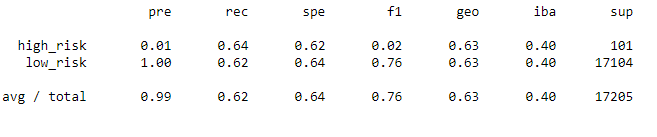
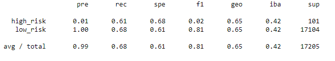
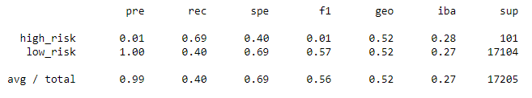
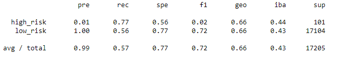
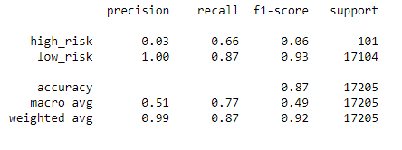
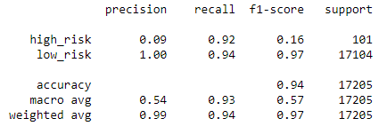

# Credit_Risk_Analysis
## Overview
Here, I examine the efficacy of 6 different machine learning methods to predict high-risk loans based on several factors.
## Results
Before going over the methods, a quick rundown. A successful model will have a high recall, or sensitivity, which means it correctly identifies the high-risk candidates. The model will also have a high balanced accuracy, meaning it has a lower number of falsely identified high-risk loans.
#### Oversampling and Undersampling methods
First, I used Naive Oversampling with the `RandomOverSampler` method from `imblearn`. This model has a balanced accuracy of 63%. This is the imbalanced classification report:

The important column to look at here is the recall column, or `rec`. This shows how effective the model is at identifying each of the high-risk loans. At 64%, this model isn't super effective, as a model missing a third of all high-risk candidates would be financially damaging.

The second method I used was `SMOTE`. This model has a balanced accuracy of 65%. This is the classification report:

This model was actually less effective than random oversampling. At 61%, this model is also not the right model to identify risky candidates.

Third, I used an undersampling method `ClusterCentroids`. This model has a balanced accuracy of 54%. This is the classification report:

At 69% recall, it's a slight improvement over the other two models, but still not sensitive enough for what is needed. In addition, this model incorrectly identified over half of all low-risk candidates as high-risk, some 10,000 loans, which is an enormous amount of data to sift through to find the actual high-risk candidates
#### Combination Over- and Undersampling
The next model is a combination over- and undersampling method called `SMOTEENN`. This model has a balanced accuracy of 67%. This is the classification report:

This method is a significant improvement at 77% recall over some of the other models. This model, however, gave a significant amount of false positives, indentifying almost have of the low-risk candidates as high risk. This is the same problem the undersampling method created.
#### Ensemble Classifiers
The first Ensemble Classifier was a Balanced Random Forest Classifier. This model has a balanced accuracy of 87%. This is the classification report:

Although this model didn't flag a ton of low-risk loans as high risk, it didn't identify enough of the high-risk as high-risk. With a sensitivity of 66%, this model isn't effective enough.

The next model was an Easy Ensemble classifier. This model has a balanced accuracy of 94%. Here is the classification report:

This model has a recall of 92%. In addition to not flagging many low-risk loans as high-risk, this model identified a vast majority of the high-risk candidates.
## Summary
The over and under sampling models struggled to not only catch a high percentage of the high-risk loans, they also flagged a ton of low-risk loans incorrectly, hence the low balanced accuracy scores. Both of the ensemble classifiers were significantly more accurate, but only the Easy Ensemble Classifier identified over 90% of the high-risk loans correctly.

In short, the only model I'd recommend is the EEC model.